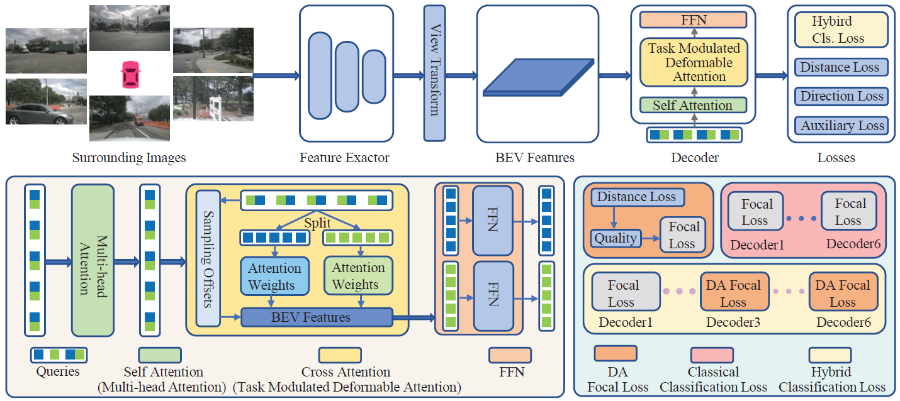

<div align="center">
<h1>DAMap </h1>
<h3>Distance-aware MapNet for High Quality HD Map Construction</h3>

Jinpeng Dong,
Chen Li,
Yutong Lin,
Jingwen Fu,
Sanping Zhou,
Nanning Zheng

<!-- [Bencheng Liao](https://github.com/LegendBC)<sup>1,2,3</sup> \*, [Shaoyu Chen](https://scholar.google.com/citations?user=PIeNN2gAAAAJ&hl=en&oi=sra)<sup>1,3</sup> \*, Yunchi Zhang<sup>1,3</sup> \*, [Bo Jiang](https://github.com/rb93dett)<sup>1,3</sup> \*,[Tianheng Cheng](https://scholar.google.com/citations?user=PH8rJHYAAAAJ&hl=zh-CN)<sup>1,3</sup>, [Qian Zhang](https://scholar.google.com/citations?user=pCY-bikAAAAJ&hl=zh-CN)<sup>3</sup>, [Wenyu Liu](http://eic.hust.edu.cn/professor/liuwenyu/)<sup>1</sup>, [Chang Huang](https://scholar.google.com/citations?user=IyyEKyIAAAAJ&hl=zh-CN)<sup>3</sup>, [Xinggang Wang](https://xinggangw.info/)<sup>1 :email:</sup> -->
 
<!-- <sup>1</sup> School of EIC, HUST, <sup>2</sup> Institute of Artificial Intelligence, HUST, <sup>3</sup> Horizon Robotics

(\*) equal contribution, (<sup>:email:</sup>) corresponding author.

ArXiv Preprint ([arXiv 2208.14437](https://arxiv.org/abs/2208.14437))

[openreview ICLR'23](https://openreview.net/forum?id=k7p_YAO7yE), accepted as **ICLR Spotlight**

extended ArXiv Preprint MapTRv2 ([arXiv 2308.05736](https://arxiv.org/abs/2308.05736)) -->
Accepted by **ICCV 2025**

</div>


## Introduction
<!-- <div align="center"><h4>MapTR/MapTRv2 is a simple, fast and strong online vectorized HD map construction framework.</h4></div> -->



High-definition (HD) map is an important component to support navigation and planning for autonomous driving vehicles. Predicting map elements with high quality (high classification and localization scores) is crucial to the safety of autonomous driving vehicles. We develop a novel HD map construction method named DAMap. Specifically, DAMap consists of three components: Distance-aware Focal Loss (DAFL), Hybrid Loss Scheme (HLS), and Task Modulated Deformable Attention (TMDA). The DAFL is introduced to assign appropriate classification labels for one-to-many matching samples. The TMDA is proposed to obtain discriminative task-specific features. Furthermore, the HLS is proposed to better utilize the advantages of the DAFL. We perform extensive experiments and consistently achieve performance improvement on the NuScenes and Argoverse2 benchmarks under different metrics, baselines, splits, backbones, and schedules.

## Models

#### nuScenes dataset

| Method  | Backbone | Epoch  | mAP |                         Config                          |                                                                   Download                                                                   |
|:-------:|:--------:|:-----:|:----:|:-------------------------------------------------------:|:--------------------------------------------------------------------------------------------------------------------------------------------:|
|  MapTRv2+DAMap  |   R50    |  24   |  62.8 | [config](projects/configs/damap/damap_tiny_r50_24ep.py) | [model](https://drive.google.com/file/d/1ybGeJbMFQwHYWBSBZzFsbpaeB1Ve5rsj/view?usp=sharing)/[log](https://drive.google.com/file/d/1WZcR9-1vuwovV2p0o8xLE7KQVn23gA0x/view?usp=sharing) |
|  MapTRv2+HLS  |   R50    |  110  |  69.4 | config | [model](https://drive.google.com/file/d/1E5SojJzYdKihAMNAw3_K6gabNv1lew8z/view?usp=sharing)/[log](https://drive.google.com/file/d/1xlXV62v8Q9JCz3WYB6Xe4BqvZshFc9tB/view?usp=sharing) |
|  Mask2Map+HLS  |   R50    |  24  |  72.6 | config | [model](https://drive.google.com/file/d/1LuxyFObekkB21AEP0AF5jJqYjHIM8iJZ/view?usp=sharing)/[log](https://drive.google.com/file/d/1OUhV6gPQknHKvO1r3YDH1__e5OGwK09c/view?usp=sharing) |


#### nuScenes dataset newsplit

| Method  | Backbone | Epoch  | mAP |                         Config                          |                                                                   Download                                                                   |
|:-------:|:--------:|:-----:|:----:|:-------------------------------------------------------:|:--------------------------------------------------------------------------------------------------------------------------------------------:|
|  MapTRv2  |   R50    |  24   |  26.9 | config | [log](https://drive.google.com/file/d/1v5onddHUqnPFjY_AZ0JoYCExoUry1BAr/view?usp=sharing) |
|  MapTRv2+DAMap  |   R50    |  24  |  28.6 | config | [log](https://drive.google.com/file/d/1XJSLdNwpYHrZCnX_aPZlC0XJlWrhrX-5/view?usp=sharing) |
<!-- 
#### nuScenes dataset with centerline


| Method  | Backbone | Epoch  | mAP |                         Config                          |                                                                   Download                                                                   |
|:-------:|:--------:|:-----:|:----:|:-------------------------------------------------------:|:--------------------------------------------------------------------------------------------------------------------------------------------:|
|  MapTRv2  |   R50    |  24   |  54.0 | config | model |
|  MapTRv2*  |   R50    |  24   |  53.2 | config | [model](https://mycuhk-my.sharepoint.com/:u:/g/personal/1155168294_link_cuhk_edu_hk/EXrwWu0yvz5Ap_aU9FFb4x8BahsKfdFgYW7TgnpsIKho2Q?e=s2CnGT) |
|  MapTRv2+DAMap  |   R50    |  24  |  58.3 | config | [model](https://mycuhk-my.sharepoint.com/:u:/g/personal/1155168294_link_cuhk_edu_hk/EV-zT_ZOIaNEvOCMNuEqjIAB2GnV8HzR-cfskRmdOJcBPQ?e=uOefF4) |

#### Argoverse2 dataset with centerline
| Method  | Backbone | Epoch  | mAP |                         Config                          |                                                                   Download                                                                   |
|:-------:|:--------:|:-----:|:----:|:-------------------------------------------------------:|:--------------------------------------------------------------------------------------------------------------------------------------------:|
|  MapTRv2*  |   R50    |  6  |  58.5 | config | [model](https://mycuhk-my.sharepoint.com/:u:/g/personal/1155168294_link_cuhk_edu_hk/EXrwWu0yvz5Ap_aU9FFb4x8BahsKfdFgYW7TgnpsIKho2Q?e=s2CnGT) |
|  MapTRv2+DAMap  |   R50    |  6  |  62.5 | config | [model](https://mycuhk-my.sharepoint.com/:u:/g/personal/1155168294_link_cuhk_edu_hk/EV-zT_ZOIaNEvOCMNuEqjIAB2GnV8HzR-cfskRmdOJcBPQ?e=uOefF4) | -->

## Getting Started
- [Installation](docs/install.md)
- [Prepare Dataset](docs/prepare_dataset.md) (Notes: annotation generation of MapTRv2 is different from MapTR )
- [Train and Eval](docs/train_eval.md)
- [Visualization](docs/visualization.md)


## Acknowledgements

DAMap is mainly based on [MapTRv2](https://github.com/hustvl/MapTR/tree/maptrv2). 

It is also greatly inspired by the following outstanding contributions to the open-source community:
[BEVFormer](https://github.com/fundamentalvision/BEVFormer),
[GKT](https://github.com/hustvl/GKT), 
[DAB-DETR](https://github.com/IDEA-Research/DAB-DETR),
[mmdetection](https://github.com/open-mmlab/mmdetection),
[GFocal](https://github.com/implus/GFocal).

## Citation
If you find MapTR is useful in your research or applications, please consider giving us a star 🌟 and citing it by the following BibTeX entry.
```bibtex
@inproceedings{DAMap,
  title={DAMap: Distance-aware MapNet for High Quality HD Map Construction},
  author={Dong, Jinpeng and Li, Chen and Lin, Yutong and Fu, Jingwen, and Zhou, Sanping and Zheng, Nanning},
  booktitle={Proceedings of the IEEE/CVF International Conference on Computer Vision},
  year={2025}
}
```

